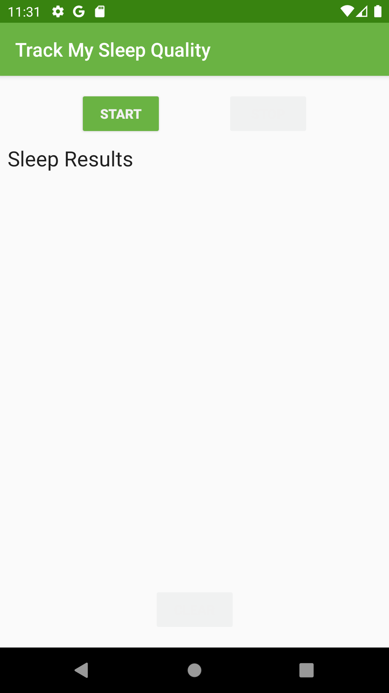
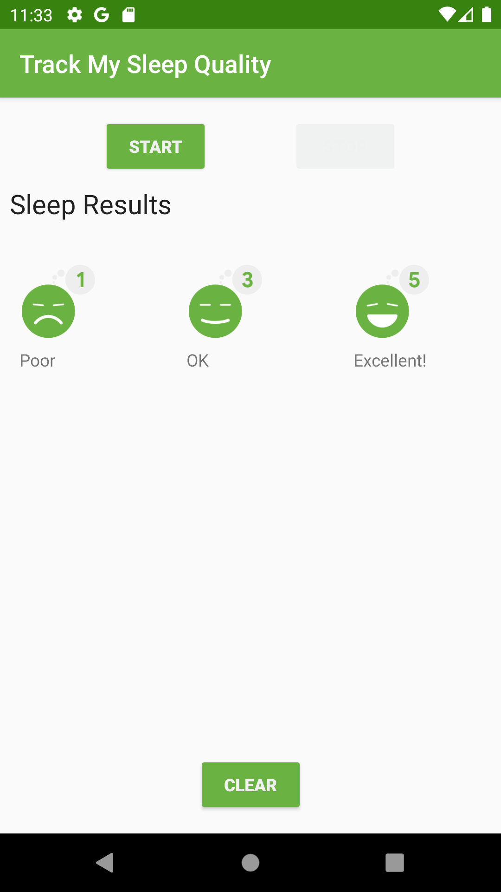
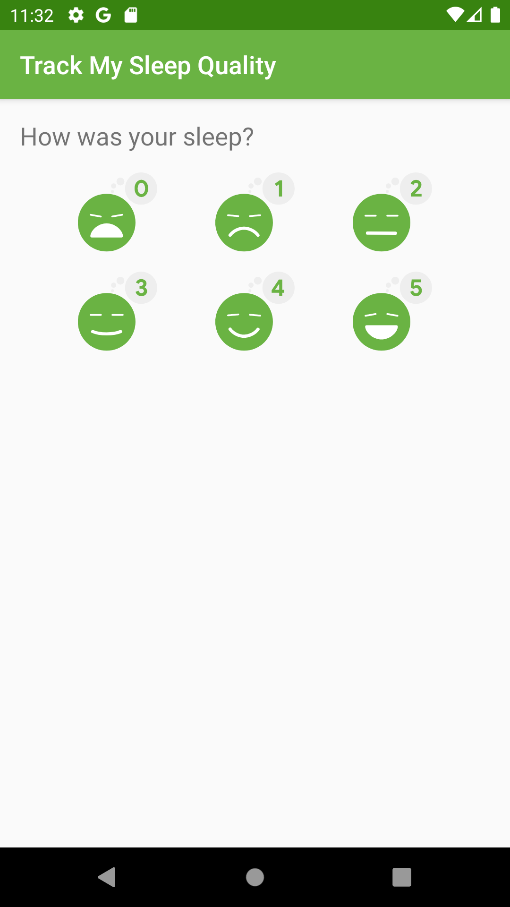
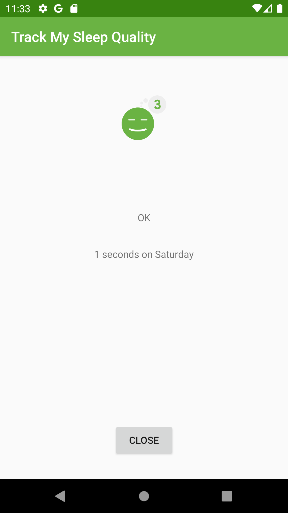

# RecyclerView - SleepQualityTracker with RecyclerView app

This is the toy app for Lesson 7 of the [Android App Development in Kotlin course on Udacity](https://classroom.udacity.com/courses/ud9012/).

## SleepQualityTracker

he SleepQualityTracker app is a demo app that helps you collect information about your sleep.

Start time
End time
Quality
Time slept

This app demonstrates the following views and techniques:
Recycler Views
Room database
DAO
Coroutines
It also uses and builds on the following techniques from previous lessons:

Transformation map
Data Binding in XML files
ViewModel Factory
Using Backing Properties to protect MutableLiveData
Observable state LiveData variables to trigger navigation
## Screenshots

